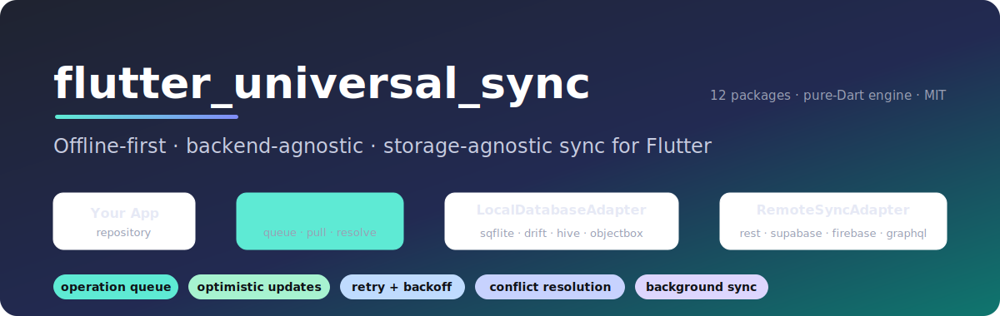

# flutter_universal_sync

<p align="center">
  
</p>

<p align="center">
  <a href="https://github.com/himanshu64/flutter_universal_sync/actions/workflows/core.yml"></a>
  <a href="https://github.com/himanshu64/flutter_universal_sync/actions/workflows/engine.yml"></a>
  
  <br>
  <a href="https://pub.dev/packages/flutter_universal_sync_core"></a>
  <a href="https://pub.dev/packages/flutter_universal_sync_engine"></a>
  
  
  <a href="LICENSE"></a>
  
</p>

Offline-first, backend-agnostic, storage-agnostic sync for Flutter — a federated package family. Write locally, the engine drains a queue to your backend with retry/backoff, pulls deltas, and resolves conflicts. Monorepo.

```
your app ─▶ repository ─▶ LocalDatabaseAdapter (sqflite / drift / hive / …)
                              ▲
                         SyncEngine  ─▶ RemoteSyncAdapter (REST / Firebase / Supabase / …)
                              ▲
                      ConnectivityMonitor (you supply)
```

## Features

- **Offline-first.** Every mutation writes the local DB and enqueues a `SyncQueueEntry` in one atomic transaction. The UI updates optimistically; the network is never on the critical path.
- **Automatic resync.** A hybrid drain loop (connectivity transitions + periodic timer + explicit `syncNow()`) pushes the queue the moment you're back online.
- **Retry with exponential backoff.** Failed pushes get `next_retry_at = now + min(2^n·1s, 5min)`; the engine skips them until their window passes.
- **Bidirectional.** `syncNow(pull: true)` fetches per-table deltas via a `since` cursor and applies them locally.
- **Conflict resolution.** Pluggable per table; the resolver fires **only** when a pulled row collides with a local pending edit. Built-ins: last-write-wins, server-priority, client-priority.
- **Observable.** A single `Stream<SyncStateSnapshot>` (`status`, `pendingCount`, `lastSyncedAt`, `lastError`) with current-value-on-subscribe semantics — bind it to any state manager.
- **Storage-agnostic.** The engine talks only to the `LocalDatabaseAdapter` interface. sqflite, drift, hive, objectbox, Isar — implement the port, the engine is unchanged.
- **Pure Dart engine.** No Flutter dependency; the connectivity glue lives in your app.

## Packages

| Package | What it is | Status |
|---|---|---|
| [`flutter_universal_sync_core`](packages/flutter_universal_sync_core/) | Contracts + capabilities: adapter interfaces, conflict resolvers, schema, errors, cache-eviction (`PurgeableAdapter`), keyset pagination (`PaginatedAdapter`), `ReachabilityMonitor`, `SubmitGuard`, `SchemaMigrator`, shared contract test-suite | 0.3.0 |
| [`flutter_universal_sync_engine`](packages/flutter_universal_sync_engine/) | The orchestration runtime: `SyncEngine`, push/pull pipelines, drain loop, FK-aware ordering, state stream | 0.1.1 |
| [`flutter_universal_sync_background`](packages/flutter_universal_sync_background/) | Headless background sync (WorkManager / BGTaskScheduler) + battery-gated runs | 0.2.0 |

### Local adapters (`LocalDatabaseAdapter`)

All run core's shared `runLocalDatabaseAdapterContract` suite.

| Package | Backend | Status |
|---|---|---|
| [`…_sqflite`](packages/flutter_universal_sync_sqflite/) | SQLite (sqflite_common) | 0.1.1 — contract-verified, 100% cov |
| [`…_drift`](packages/flutter_universal_sync_drift/) | drift (raw SQL, no codegen) | 0.1.0 — contract-verified, 96% cov |
| [`…_hive`](packages/flutter_universal_sync_hive/) | Hive (optional AES-256 at rest) | 0.1.1 — contract-verified, 98% cov |
| [`…_objectbox`](packages/flutter_universal_sync_objectbox/) | ObjectBox | 0.1.0 — reference skeleton (needs codegen + native lib) |

### Remote adapters (`RemoteSyncAdapter`)

See [Writing an adapter](#writing-an-adapter) for the shared conventions.

| Package | Backend | Status |
|---|---|---|
| [`…_rest`](packages/flutter_universal_sync_rest/) | any REST/JSON API | 0.1.0 — mock + live (jsonplaceholder), 96% cov |
| [`…_supabase`](packages/flutter_universal_sync_supabase/) | Supabase (PostgREST) | 0.1.0 — mock-tested, 100% cov |
| [`…_appwrite`](packages/flutter_universal_sync_appwrite/) | Appwrite Databases | 0.1.0 — mock-tested, 100% cov |
| [`…_graphql`](packages/flutter_universal_sync_graphql/) | any GraphQL API | 0.1.0 — mock + live (SpaceX), 100% cov |
| [`…_firebase`](packages/flutter_universal_sync_firebase/) | Cloud Firestore (REST) | 0.1.0 — mock-tested, 98% cov |

### Capability packages

Optional add-ons, each behind a stable interface — bring in only what you need.

| Package | What it adds | Status |
|---|---|---|
| [`…_crdt`](packages/flutter_universal_sync_crdt/) | `LwwMapResolver` — per-field LWW-Element-Map CRDT `ConflictResolver` | 0.1.0 — 100% cov |
| [`…_attachments`](packages/flutter_universal_sync_attachments/) | `ChunkedUploader` + `AttachmentQueue` — resumable chunked media uploads | 0.1.0 — 100% cov |
| [`…_realtime`](packages/flutter_universal_sync_realtime/) | `RealtimeChannel` — WebSocket/SSE server-push applied to the local store, reconnect-with-backoff | 0.1.0 — 100% cov |
| [`…_auth`](packages/flutter_universal_sync_auth/) | `AuthSession` — offline-first auth: cached token survives offline, refreshes on reconnect, Bearer headers | 0.1.0 — 100% cov |

Plus, built into existing packages: **idempotency-key** headers (REST), **encrypted-at-rest** storage (Hive), **FK-aware ordering** (engine `dependencies`), **cache eviction** + **keyset pagination** (sqflite/Hive/in-memory), **network state detection** (`ReachabilityMonitor`), **duplicate-submit guard** (`SubmitGuard`), **schema migrations** (`SchemaMigrator`), and **battery-gated background runs**. See [CHALLENGES.md](CHALLENGES.md).

A runnable end-to-end example lives in [`examples/sync_demo`](examples/sync_demo/) (Flutter UI + demo-grade sqflite & REST adapters + the Node test backend in [`examples/test-backend`](examples/test-backend/)).

## Writing an adapter

The engine talks to two interfaces, so adding a backend never touches the engine.

**`LocalDatabaseAdapter`** (local stores) — implement the interface and prove it
by running core's shared `runLocalDatabaseAdapterContract` suite (the same suite
the sqflite/drift/hive adapters pass). It owns two internal tables (`sync_queue`
with `next_retry_at`, and the `_sync_meta` KV); your domain tables are yours.
`transaction` must be atomic (writes roll back on throw); `insert` on a duplicate
id throws `StateError`.

**`RemoteSyncAdapter`** (backends) — two methods:

```dart
Future<void> pushChange(SyncQueueEntry entry);                        // one op
Future<List<Map<String, dynamic>>> pullChanges(String table, DateTime? since);
```

Shared conventions across the shipped remote adapters:

- **push** maps insert/update/delete to the backend's write (e.g. POST/PUT/DELETE
  or an upsert). Throw `SyncPushException` on failure — the engine retries with
  backoff.
- **pull** returns rows changed since the cursor; filter on
  `updated_at > since OR deleted_at > since` so soft-deletes propagate, and
  paginate internally. Throw `SyncPullException` on failure.
- **delete is a write**, not a hard delete — it sets `deleted_at` (a tombstone)
  so peers pull it.
- **conflicts** are pull-side only in v1: a push 409 surfaces as
  `SyncPushException` and retries; there is no push-side resolver.
- **auth** is read per request (pass a token/header callback) so rotating tokens
  work without rebuilding the adapter.

HTTP adapters take an injectable `http.Client` and are unit-tested with
`package:http/testing`'s `MockClient`; local adapters inject their
`DatabaseFactory`/`QueryExecutor` so they `dart test` headlessly.

## Quickstart

```yaml
dependencies:
  flutter_universal_sync_core: ^0.2.0
  flutter_universal_sync_engine: ^0.1.0
  connectivity_plus: ^6.0.0   # for the reference ConnectivityMonitor
```

**1 — Implement a `ConnectivityMonitor`** (pure-Dart engine, so you own this; reference impl uses `connectivity_plus`):

```dart
class ConnectivityPlusMonitor implements ConnectivityMonitor {
  ConnectivityPlusMonitor({Connectivity? connectivity})
      : _connectivity = connectivity ?? Connectivity() {
    _sub = _connectivity.onConnectivityChanged.listen((results) {
      final online = results.any((r) => r != ConnectivityResult.none);
      if (online != _isOnline) { _isOnline = online; _controller.add(online); }
    });
    unawaited(_seed());
  }
  final Connectivity _connectivity;
  late final StreamSubscription _sub;
  final _controller = StreamController<bool>.broadcast();
  bool _isOnline = false;
  Future<void> _seed() async =>
      _isOnline = (await _connectivity.checkConnectivity())
          .any((r) => r != ConnectivityResult.none);
  @override bool get isOnline => _isOnline;
  @override Stream<bool> get onChange => _controller.stream;
}
```

**2 — Construct and start the engine** (with your local + remote adapters):

```dart
final engine = SyncEngine(
  localDb: mySqfliteAdapter,        // any LocalDatabaseAdapter
  remote: myRestAdapter,            // any RemoteSyncAdapter
  connectivity: ConnectivityPlusMonitor(),
  tables: const {
    'things': TableConfig(conflictResolver: LastWriteWinsResolver()),
  },
);
await engine.start();               // begins the auto-drain loop
```

**3 — Write offline-first** (in your repository; one atomic transaction):

```dart
await local.transaction(() async {
  await local.insert('things', thing.toMap());        // optimistic local row
  await local.enqueueSync(SyncQueueEntry(             // queued for push
    id: uuid(), table: 'things', entityId: thing.id,
    operation: SyncOperation.insert, payload: thing.toMap(),
    createdAt: DateTime.now().toUtc(),
  ));
});
```

**4 — Observe state and trigger pulls:**

```dart
engine.state.listen((s) {
  // s.status: idle | syncing | error ; s.pendingCount ; s.lastError
});
await engine.syncNow(pull: true);   // e.g. pull-to-refresh
```

### How offline edits resync (the core loop)

1. Offline write → row + queue entry land locally, atomically. UI shows `pending`.
2. Engine drains while offline → `isOnline == false`, so it's a no-op; the entry waits.
3. Connectivity returns → the `onChange` false→true transition fires a cycle **immediately**; the push pipeline picks up the entry (its `next_retry_at` is past), pushes it, and marks it synced. UI flips to `synced`.
4. Persistent server failures back off exponentially (1s→2s→…→5min) instead of hot-looping.

## State-management integration

The engine exposes a plain `Stream<SyncStateSnapshot>` and synchronous `current`, so it drops into any state manager. Construct **one** engine at app root and share it.

### flutter_bloc

Wrap the engine's stream in a `Cubit`, and expose explicit triggers:

```dart
class SyncCubit extends Cubit<SyncStateSnapshot> {
  SyncCubit(this._engine) : super(_engine.current) {
    _sub = _engine.state.listen(emit);
  }
  final SyncEngine _engine;
  late final StreamSubscription<SyncStateSnapshot> _sub;

  Future<void> refresh() => _engine.syncNow(pull: true);

  @override
  Future<void> close() async {
    await _sub.cancel();
    await super.close();   // note: dispose the engine itself at app teardown
  }
}
```

Provide it once (after the async bootstrap that opens the DB and starts the engine):

```dart
BlocProvider(
  create: (_) => SyncCubit(engine),
  child: const MyApp(),
);
```

Bind the UI:

```dart
BlocBuilder<SyncCubit, SyncStateSnapshot>(
  builder: (context, sync) => switch (sync.status) {
    EngineStatus.syncing => const CircularProgressIndicator(),
    EngineStatus.error   => Tooltip(message: sync.lastError ?? '',
                              child: const Icon(Icons.sync_problem)),
    EngineStatus.idle    => IconButton(
                              onPressed: context.read<SyncCubit>().refresh,
                              icon: Badge(
                                isLabelVisible: sync.pendingCount > 0,
                                label: Text('${sync.pendingCount}'),
                                child: const Icon(Icons.sync))),
  },
);
```

Domain writes stay in a separate repository/bloc that calls `local.transaction { insert + enqueueSync }`; the engine drains them independently — your domain bloc never talks to the network.

### Riverpod

Expose the engine and its state as providers. Because the engine needs async setup (open the DB), bootstrap it in a `FutureProvider` (or override a `Provider` at app start):

```dart
// Built once during app bootstrap, then injected via override.
final syncEngineProvider = Provider<SyncEngine>(
  (ref) => throw UnimplementedError('override syncEngineProvider in main()'),
);

// Reactive snapshot stream — current value delivered on first listen.
final syncStateProvider = StreamProvider<SyncStateSnapshot>((ref) {
  return ref.watch(syncEngineProvider).state;
});
```

```dart
Future<void> main() async {
  WidgetsFlutterBinding.ensureInitialized();
  final engine = await bootstrapEngine();   // open DB, build adapters, start()
  runApp(ProviderScope(
    overrides: [syncEngineProvider.overrideWithValue(engine)],
    child: const MyApp(),
  ));
}
```

Bind the UI:

```dart
class SyncBadge extends ConsumerWidget {
  const SyncBadge({super.key});
  @override
  Widget build(BuildContext context, WidgetRef ref) {
    final sync = ref.watch(syncStateProvider);
    return sync.when(
      data: (s) => switch (s.status) {
        EngineStatus.syncing => const CircularProgressIndicator(),
        EngineStatus.error   => const Icon(Icons.sync_problem),
        EngineStatus.idle    => IconButton(
            onPressed: () => ref.read(syncEngineProvider).syncNow(pull: true),
            icon: const Icon(Icons.sync)),
      },
      loading: () => const SizedBox.shrink(),
      error: (e, _) => const Icon(Icons.error),
    );
  }
}
```

Tip: dispose the engine when the root scope tears down — `ref.onDispose(engine.dispose)` if you build it inside a provider, or in your app's shutdown path.

## Database Inspector

The example app ships an embedded **Database Inspector** web UI so you can watch sync state live while you poke the app. On launch it logs:

```
🔍 Database Inspector running at http://localhost:8090  (open in a browser)
```

Open that URL in a browser to get:

- **Per-table tabs** (`things`, `sync_queue`, `_sync_meta`) with row counts, auto-refreshing every 2s.
- **Click-to-sort** columns and a **substring filter** box.
- A **read-only SQL runner** (SELECT / PRAGMA only) for ad-hoc queries.

Try it: turn off Wi-Fi, add an item → watch it appear in `sync_queue` with `synced=0`; turn Wi-Fi back on → watch the row get marked synced and the `_sync_meta` pull cursor advance. It's a dev tool only (no auth, binds locally); see [`examples/sync_demo/lib/dev/database_inspector.dart`](examples/sync_demo/lib/dev/database_inspector.dart).

> On Android/iOS the server runs on the device — open `localhost:8090` in a browser on the device, or forward the port to your host (e.g. `adb forward tcp:8090 tcp:8090`).

## Docs

- **[Offline-first challenges → coverage map](CHALLENGES.md)** — the 19 hard
  problems of offline sync (conflicts, queues, temp IDs, idempotency, schema
  migration, security, background limits, …) and exactly what this family
  handles built-in, partially, or leaves to your app.
- **[Sample apps](apps/)** — four runnable apps (Clean Architecture · MVVM ·
  VIPER) on the same stack, plus a [battery-performance guide](apps/BATTERY_PERFORMANCE.md).

The design lives with the code — each package has its own README:
[core](packages/flutter_universal_sync_core/README.md) ·
[engine](packages/flutter_universal_sync_engine/README.md) (public API,
idempotency, limitations) ·
[background](packages/flutter_universal_sync_background/README.md) (headless
design + WorkManager wiring) · and one per adapter. The cross-cutting adapter
contract is in [Writing an adapter](#writing-an-adapter) above.

## License

MIT
